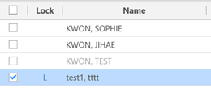

# Portal Patient Registration

To use the Patient Portal, the practice must first Web-enable those patients who need access to the system. That is, the practice must set up those patients with the appropriate access rights and information handling capability to log in and use the Portal’s functionality.

1. Click on the Patient Portal > Portal Patient menu.\
   .png>)
2.  Type the name of the patient in the search filed.\
    Patient who hasn’t been yet verified for the email shows in gray color. There are columns which are Lock and Patient ID. If the portal patient doesn’t allow to log in the Portal, the Lock column of the patient will have an ‘L’. If the portal patient matched with the RIS’s practice patient, the Patient ID column will have the RIS’s Patient ID.\

    

3. If you want for the patient not to log in the patient portal, select the patient and click the Lock button. If you undo this action, select the patient and click the Lock column of the patient.\
   
4.  If you want to match the patient with the RIS practice patient, select the patient and click the match button. \
    **Select RIS Patient to be matched with Portal Patient.**

    * [x] The name, DOB, E-mail, Phone# will be set as the information of the portal patient selected from the Portal Patient worklist.
    * [x] This window that allows users to search for any patient in RIS system.\
      .png>)
    * [x] Select the RIS patient who will be matched with the selected Portal Patient. You can select the information to update RIS patient information with the Portal Patient Information as matching.\
      .png>)
    * [x] After that, the RIS patient will be matched with the Portal Patient\

    &#x20;
5. If you want to unmatch the patient with the RIS practice patient, select the patient and click the Patient ID column of the patient.\
   .png>).png>)
6. If you want to delete the portal patient from the system, select the patient and click the delete button. \


**Info:** Able to send email to the portal patient as matching with RIS patient when turning on the profile, “PATIENTPORTAL>ENABLE\_EMAILNOTI\_EVENT”.



**Info:** In case that RIS patient should be registered in advance before Portal patient is registered, turn on the profile PATIENTPORTAL > ENABLE\_PATIENT\_CHECK\_REQUIRED. When this profile turns on, RIS patient should be registered manually or HL7 from HIS/EMR as portal patient is registered. So, there is no need to match portal patient with RIS patient manually.

